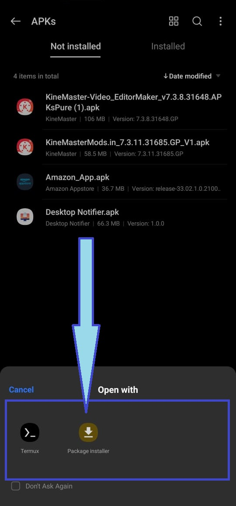
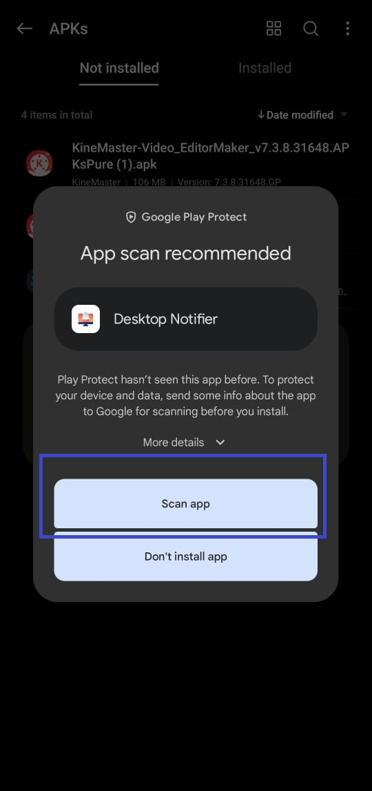
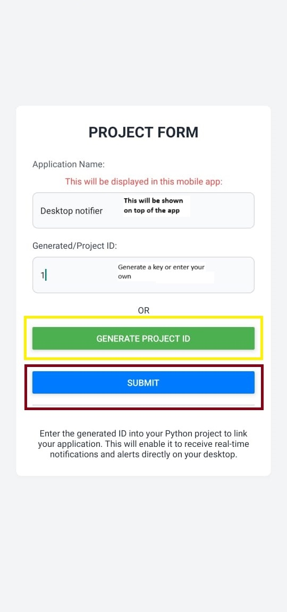
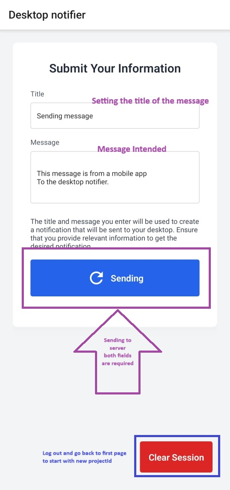
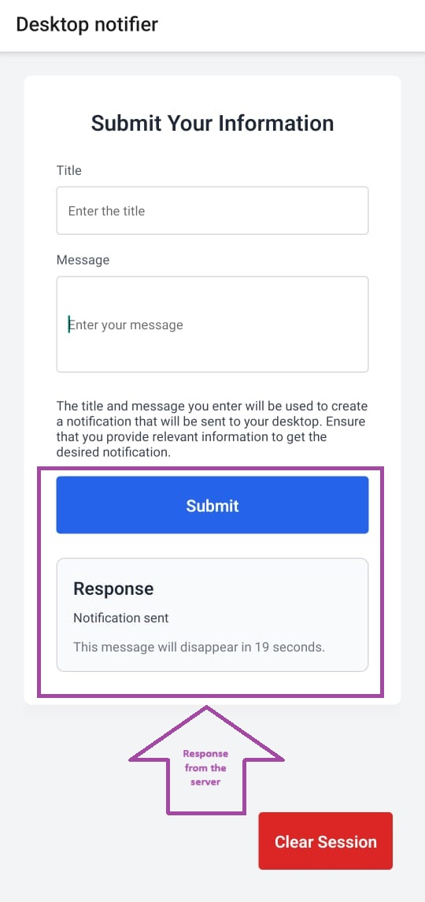
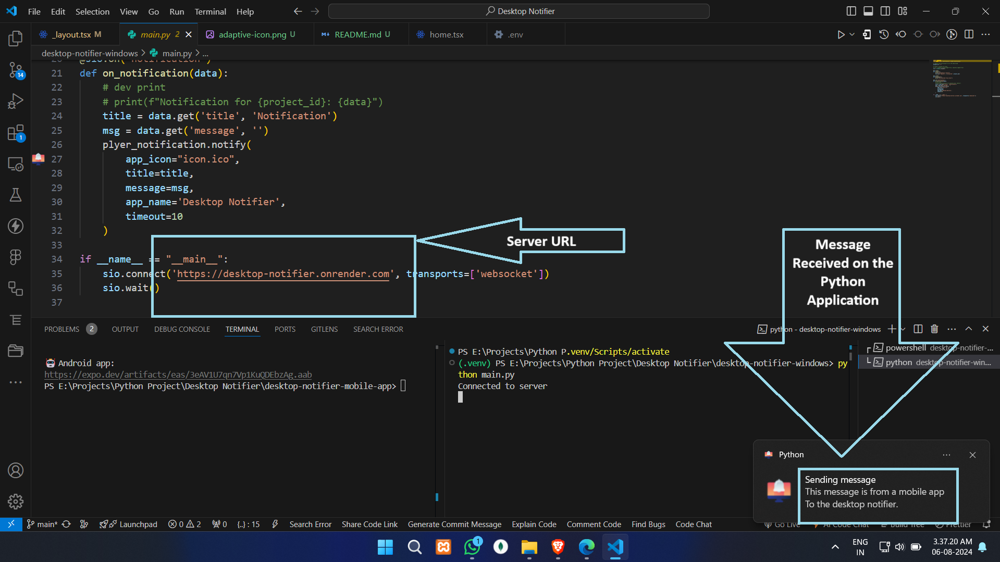

<p align="center">
   
</p>

---

# Desktop Notifier

Desktop Notifier is a comprehensive project comprising a React Native mobile application, an Express server with WebSocket support, and a Python desktop application. The system is designed to send real-time notifications to desktop applications based on specific project IDs.

This repository consists of five projects:

1. **`:root/index.js`**: An Express server that handles WebSocket connections to send messages.
2. **`:root/desktop-notifier-mobile-app`**: A React Native mobile app that uses the Express server to send messages.
3. **`:root/desktop-notifier-windows/gui_with_server`**: A Python project with a GUI that sends mobile notifications to the desktop.
4. **`:root/desktop-notifier-windows/gui_without_server`**: A Python project with a GUI but without a server.
5. **`:root/desktop-notifier-windows/without_gui_with_server`**: A Python project without a GUI but with a server.

## Features

- Real-time notifications from a React Native app to desktop applications.
- WebSocket-based communication for instant updates.
- Notifications are filtered and sent to the appropriate project-specific clients.

## Project Structure

- **React Native App**: Sends notifications to the server.
- **Express Server**: Manages WebSocket connections and routes notifications to the appropriate clients.
- **Python Desktop Application**: Listens for notifications from the server and displays them using system notifications.

## Installation

### Prerequisites

- Node.js and npm installed.
- Python installed.

### 1. Clone the Repository

```bash
git clone https://github.com/sangamprashant/desktop-notifier.git
cd desktop-notifier
```

### 2. Setup the Express Server

#### Install Dependencies

```bash
npm install
```

#### Configure Environment Variables

Create a `.env` file in the root directory of the project with the following content:

```
PORT=8000
```

#### Start the Server

```bash
npm start
```

### 3. Setup the React Native App

#### Install Dependencies

```bash
cd desktop-notifier-mobile-app
npm install
```

#### Run the App

```bash
npm start
```

### 4. Setup the Python Desktop Application

#### Install Dependencies

```bash
cd desktop-notifier-windows
python -m venv env
source env/bin/activate
pip install -r requirements.txt
```

#### Run the Application

```bash
python main.py
```

## Usage

### Sending Notifications

1. Open the React Native app (Desktop Notifier).
2. Enter the project ID (ID should be the same as the receiver's end).
3. Enter the title and message.
4. Send the notification.

### Receiving Notifications

1. Ensure the Python desktop application is running on all devices.
2. Each desktop application should register with the server using its specific project ID.
3. Notifications sent from the React Native app will be received by the appropriate desktop applications.

## Contributing

Contributions are welcome! Please fork the repository and submit a pull request for any enhancements or bug fixes.

## License

This project is licensed under the MIT License - see the [LICENSE](LICENSE) file for details.

## Additional Information

- Ensure that the WebSocket connection URL in the Python script matches your server's URL.
- You can customize the notification icon by replacing `"icon.ico"` with the path to your desired icon file.
- The project ID should be unique for each project to ensure that notifications are sent to the correct clients.

By following this guide, you'll be able to set up and run the Desktop Notifier project, allowing you to send real-time notifications from a React Native app to desktop applications using WebSocket and system notifications.

## Download the Builds

<p align="center">
   <a href="https://github.com/sangamprashant/desktop-notifier/releases">
   </a>
</p>

## Screenshots of the Mobile App

The UI is built using Tailwind CSS with NativeWind for styling.

### General Layout

<div style="display: flex; justify-content: space-between; flex-wrap: wrap;" align="center">
   
   
</div>
<div style="display: flex; justify-content: space-between; flex-wrap: wrap; margin-top: 10px;" align="center">
   
   
</div>
<div style="display: flex; justify-content: space-between; flex-wrap: wrap; margin-top: 10px;" align="center">
   
</div>

