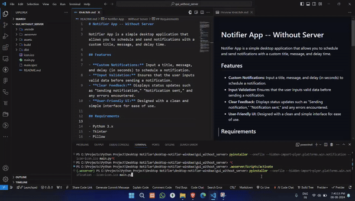

# Notifier App -- Without Server 

Notifier App is a simple desktop application that allows you to schedule and send notifications with a custom title, message, and delay time.

## Features

- **Custom Notifications:** Input a title, message, and delay (in seconds) to schedule a notification.
- **Input Validation:** Ensures that the user inputs valid data before sending a notification.
- **Clear Feedback:** Displays status updates such as "Sending notification," "Notification sent," and any errors encountered.
- **User-Friendly UI:** Designed with a clean and simple interface for ease of use.

## Requirements

- Python 3.x
- Tkinter
- Pillow
- Plyer
- Python-SocketIO

## Installation

1. **Clone the repository:**
   ```bash
   https://github.com/sangamprashant/desktop-notifier
   cd desktop-notifier
   ```

2. **Install the required Python packages:**
   ```bash
   pip install pillow python-socketio plyer
   ```

3. **Place the `icon.ico` file in the project directory.**

## Usage

1. **Run the application:**
   ```bash
   python main.py
   ```

2. **Build the executable:**
   To build the application into a standalone executable, use the following command:
   ```bash
   pyinstaller --onefile --hidden-import=plyer.platforms.win.notification --icon=icon.ico main.py
   ```

   The executable will be created in the `dist/` directory.

3. **Download Prebuilt Release:**
   - Alternatively, you can download a prebuilt version of the application from the [Releases](https://github.com/yourusername/notifier-app/releases) page.

4. **Using the Notifier App:**
   - Enter a **Title** and **Message** for your notification.
   - Specify the **Delay** (in seconds) after which the notification should appear.
   - Click **Send Notification** to schedule the notification.

## Notes

- The notification icon (`icon.ico`) should be placed in the same directory as the application for proper display.
- The application supports Windows notification using the Plyer library.

---

## Demo

